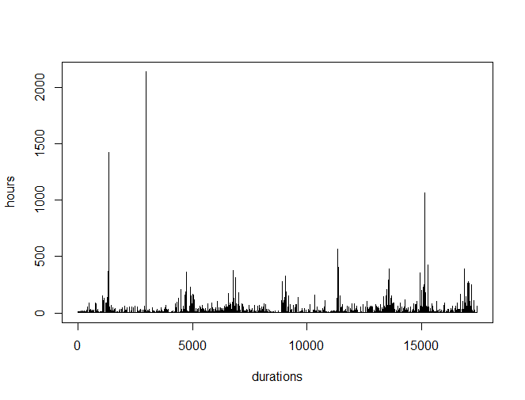
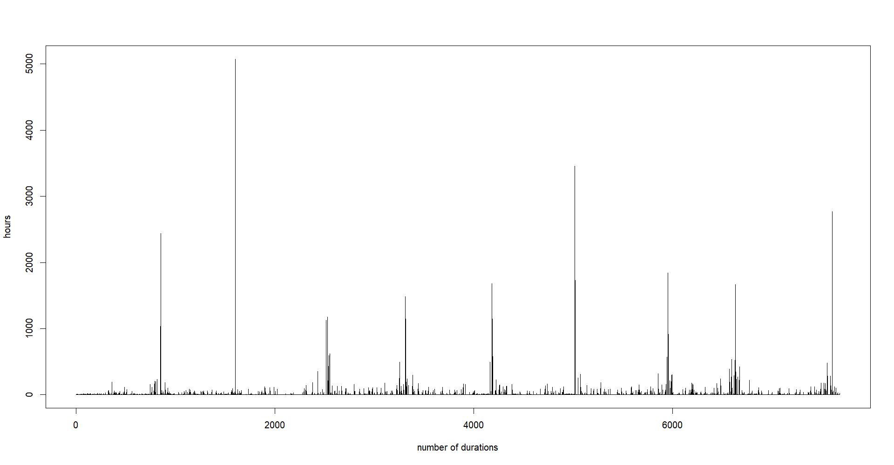
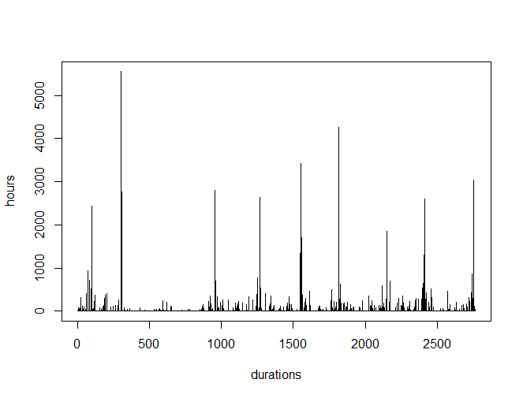
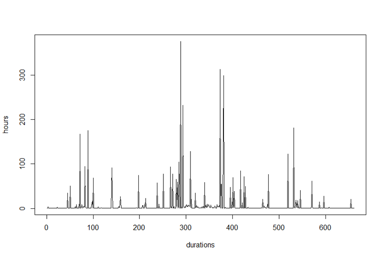

## Introduction

The Engle and Russell \cite{ACD} paper introduced the ACD model, which presents a new way of modelling random durations arising from high frequency data. 

Log-ACD model introduced by Luc Bauwens, Pierre Giot \cite{LogACD} is the logarithmic version of the ACD model that allows to introduce additional variables without sign restrictions on their coefficients.

The ACD models are used for the analysis of data which arrive at irregular intervals. 

The model treats the time between events as a stochastic process and proposes a new class of point processes with dependent arrival rates.\

## Introduction (Cont..) 

In this presentation several simulation studies are shown for different types of Log-ACD models.

Also we have shown a short example where we have tried to fit an Log-ACD model for wave height duration. 

This is a very unusual example for duration models as its mainly used for financial application. 

Here we have modeled wave height duration as a function of four different exogenous variables. 

## Motivation

With an increase in data availability and computing power the amount of high frequency data have been increasing really fast. And in order to tackle these types of datasets new techniques has to be introduced and one such techniques is duration modeling. The main motivation behind the introduction of this model was to handle transaction level data. So in order to understand the market structures better it was useful to study the durations of transactions.\ 

\
Also these types of data occur in irregular time instances. So the arrival time of these transactions are considered as random variables which follow a point process. The main goal of this model is to understand and forecast the intervals of transaction arrivals.\ 

## Background

The Autoregressive conditional Heteroskedasticity (ARCH) and Generalized Autoregressive conditional Heteroskedasticity (GARCH) models are considered an important modeling tool if the goal of the study is to analyze and forecast volatility in a data especially in financial applications. 

In a linear regression the variances of the error terms are assumed to be constant throughout the data. if this is not satisfied then we say the data is affected by Heteroskedasticity. In that case linear model may not provide precise conclusions. This situation is tackled by the ARCH/GARCH framework which models these variances.

## ARCH

Suppose we are modeling the logged returns $R_t$. 

The ARCH(1) model is defined as:

$R_t=\sigma_t\epsilon_t$\

$\sigma_t^2=\alpha_0+\alpha_1R_{t-1}^2$\

where $\alpha_0$ and $\alpha_1$ $\geq$ 0

and $\epsilon_t$ ~ iid N(0,1)

Here the conditional variance is modeled as an AR(1) process.\

## GARCH

The GARCH(1,1) model is defined as:

$R_t=\sigma_t\epsilon_t$\

$\sigma_t^2=\alpha_0+\alpha_1R_{t-1}^2+\beta_1\sigma_{t-1}^2$\

where $\alpha_0$ and $\alpha_1$ $\geq$ 0

and $\epsilon_t$ ~ iid N(0,1)

Here the conditional variance is modeled as an ARMA(1,1) process.\

It gives parsimonious models which are easy to estimate and has proven successful in predicting conditional variances. 

## Relationship between GARCH and ACD

Several models have been developed from the ARCH/GARCH models. One such model is the Autoregressive Conditional Duration (ACD) model. 

Especially the ACD model is considered as an counterpart of the GARCH model. The ACD model is used to analyze the financial durations rather than the returns. 

That is instead of Modeling the conditional variances we model the conditional mean of the durations.

## Duration Models

Durations in finance are considered as the time interval between trades. 

Longer duration indicate lack of trading activity which implies that there is no new information. 

Arrival of new information leads to more activity which in turn implies shorter durations. 

Thus the behaviour of the durations provide useful information about the market.

These are very useful in studying irregularly spaced financial transaction data.

## ACD Model

The Autoregressive Conditional Duration model or ACD models are defined in terms of conditional density of durations. 

The duration is obtained as:

$x_i = t_i - t_{i-1}$

That is, the durations $x_i$ represents the interval between two time points of the event occurring.

Let $\psi_i$ be the expectation of the ith duration then we have,

$E(x_i | x_{i-1}, ..., x_1) = \psi_i$ 

## ACD Model (Cont..)

Then we define the durations $x_i$ as:

$x_i = \psi_i \epsilon_i$

where $\epsilon_i ~$ i.i.d with $E(\epsilon_i)=1$. And 

$\psi_i = \omega + \sum_{j=0}^m \alpha_j x_{i-j} + \sum_{j=0}^q \beta_j \psi_{i-j}$

With the following constraints on the coefficients: $\omega > 0$, $\beta \geq 0$, $\alpha \geq 0$ and $\alpha + \beta < 1$.

This is called an ACD(m, q) where the m and q refer to the orders of the 
lags.

## SCD Model

$x_i = e^{\psi_i} \epsilon_i$

where $\epsilon_i ~$ i.i.d with $E(\epsilon_i)=1$. And 

$\psi_i = \omega + \sum_{j=0}^m \alpha_j x_{i-j} + \sum_{j=0}^q \beta_j \psi_{i-j} + z_i$

where $z_i$ ~ iid $N(0,\sigma_z^2)$ and $z_i$ and $\epsilon_i$ are independent.

The conditional expected duration, which was a fixed function of unknown parameters under the ACD model, is assumed to be a random variable under the SCD model, as in state space models.

## Log-ACD Model

In the logarithmic ACD model or log-ACD model the autoregressive equation is defined as the logarithm of the conditional expectation of the durations. 

This model relaxes the non-negativity constraint imposed by the ACD model and thus its more flexible than the ACD model. 

Let the conditional expectation of the ith duration be defined as,

$E(x_i | x_{i-1}, ..., x_1) = e^{\phi_i} \mu_{\epsilon}$ 

## Log-ACD Model (Cont..)

Then we define the durations $x_i$ as:

$x_i = e^{\phi_i} \epsilon_i$

where $\epsilon_i$ ~ i.i.d with $E(\epsilon_i)=\mu_{\epsilon}$. 

Suppose

$exp(\psi_i) = exp(\phi_i) \epsilon_i$ 

where

$\psi_i = \omega + \sum_{j=0}^m \alpha_j log x_{i-j} + \sum_{j=0}^q \beta_j \psi_{i-j}$

Then we can rewrite

$x_i = \frac{e^{\psi_i}}{\mu_{\epsilon}} \epsilon_i$

## Log-ACD Model (Cont..)

With the following constraints: $|\alpha_j + \beta_j| < 1$.

This is called an Log-ACD(m, q) where the m and q refer to the orders of the 
lags. 

Note that if $\mu_{\epsilon}$ = 1. 

Then we can just simply define the model as:

$x_i = e^{\psi_i} \epsilon_i$

$\psi_i = \omega + \sum_{j=0}^m \alpha_j log x_{i-j} + \sum_{j=0}^q \beta_j \psi_{i-j}$

The same constraint as above holds. 

Log-SCD models can also be obtained in a similar manner as done for the ACD. 

## Likelihood Function

Let ($x_1,...,x_n$) be the observed durations. 

And $\theta=(\omega, \alpha_1, ..., \alpha_p, \beta_1,..., \beta_q)$ be the parameters that needs to be estimated and let g = max(p, q). 

Then if the form of the density $f_{\epsilon}(.)$ of errors is known, the distribution $f(x_i|x_{i-1},\theta)$ can be directly derived then the maximum likelihood estimates $\hat\theta$ can be obtained by maximizing the conditional likelihood function

$L(\theta|x_n) = \prod_{i=g+1}^n f(x_i|x_{i-1},\theta)$

## Likelihood Function for ACD

If we assume that the error follows an exponential distribution then the likelihood function for the ACD model is:

The likelihood function is written as: \

$l(\theta|x_n)=\prod_{i=1}^n\frac{1}{\psi_i}exp(\frac{-x_i}{\psi_i})$\

Then taking log on both sides\

$L(\theta|x_n)=\sum_{i=1}^n-log(\psi_i)-(\frac{x_i}{\psi_i})$\

Which can be written as:\

$L(\theta|x_n)=-\sum_{i=g+1}^n[log(\psi_i)+(\frac{x_i}{\psi_i})]$\

## Likelihood Function for Log-ACD

Similarly if we assume that the error follows an exponential distribution then the likelihood function for the Log-ACD model is:

The likelihood function is written as: \

$l(\theta|x_n)=\prod_{i=1}^n\frac{1}{exp(\psi_i)}exp(\frac{-x_i}{exp(\psi_i)})$\

Then taking log on both sides\

$L(\theta|x_n)=\sum_{i=1}^n-\psi_i-(\frac{x_i}{exp(\psi_i)})$\

Which can be written as:\

$L(\theta|x_n)=-\sum_{i=1}^n[\psi_i+(\frac{x_i}{exp(\psi_i)})]$\

## Other ways to estimate the parameters

Sometimes it is not possible to assume a distribution for the errors in practice. In order to accommodate for that alternate distribution free approaches were introduced. One such approach is based on the martingale estimation functions which does not have any distributional assumption as discussed in Yaohua Zhang et al \cite{EE}. It is similar to the generalized method of moments as it only requires the first four conditional moments of the durations. 

This is done by deriving optimal combined estimating equations based on both linear and generalized martingale differences, and by proposing recursive estimating equations based on the combined estimating equations.

## Data Description

This data can be obtained from two main portals: the National Oceanic and Atmospheric Administration (NOAA) and the United States Army Corps of Engineers (USACE) databases. Buoy fleets are independently owned and operated by universities, private research institutes, and government agencies. The data is from NOAA buoy 44039 in the Central Long Island Sound. 

The dataset contains the following variables: Year, Month, Day, Hour, Wave height, Wind speed, Fetch, Wind speed square, Z2, Z3 and Z4. The variables Z2, Z3 and Z4 are computed as follows:

$Z_{2,t-r} = Speed_{t-r} \sqrt{Fetch_{t-r}}$

$Z_{3,t-r} = Fetch_{t-r}$

$Z_{4,t-r} = \frac{Fetch_{t-r}^{3/2}}{Speed_{t-r}}$

## Data Preparation

So the data is available for each hour from the 11-01-2004 to 10-31-2013. Another important thing to note is each year can be divided into two periods: (i) Windy Months (Nov-Mar) (ii) Calm Months (Apr-Oct). So modeling can also be done in two ways: (i) Consider entire day as a single time series and build the model (ii) Consider yearly data for Calm/Windy period and build models for each period/year.

The durations are calculated based on some threshold for the Wave heights and they are calculated in hours. So we can do this based on 3 different thresholds: 2ft, 3ft and 4ft. That is the durations are calculated as the difference in the time for a wave to reach a threshold. 

## Plots of Durations

1) Duration plot for the entire data based on 2ft threshold:

```{r  label = "2ft durations", echo = FALSE, fig.cap = "Wave duration at 2ft threshold", out.width = '80%'}

```

## Plot for 3ft 

2) Duration plot for the entire data based on 3ft threshold:

```{r  label = "3ft durations", echo = FALSE, fig.cap = "Wave duration at 3ft threshold", out.width = '80%'}

```

## Plot for 4ft 

3) Duration plot for the entire data based on 4ft threshold:

```{r  label = "4ft durations", echo = FALSE, fig.cap = "Wave duration at 4ft threshold", out.width = '80%'}

```

From the plots we can see that the pattern of the plot looks similar and the only difference is the duration length.

## Plots based on Calm Season

1) Duration plot for calm period based on 2ft threshold for the year 2008:

```{r  label = "Calm Season", echo = FALSE, fig.cap = "Wave duration of Calm Season for the year 2008", out.width = '80%'}

```

## Plots based on Windy Season

2) Duration plot for Windy period based on 2ft threshold for the year 2008:

```{r  label = "Windy Season", echo = FALSE, fig.cap = "Wave duration of Windy Season for the year 2008", out.width = '80%'}
knitr::include_graphics("Picture2.png")
```

## Log-ACD Model with exogenous variables

We define the durations $x_i$ with exogenous variables as:

$x_i = e^{\psi_i} \epsilon_i$

where $\epsilon_i ~$ i.i.d with some density. 

and 

$\psi_i = \omega + \sum_{j=0}^m \alpha_j ln x_{i-j} + \sum_{j=0}^q \beta_j \psi_{i-j}+\sum_{j=1}^r\delta_jz_{i,j}$

Where $z_{i,j}$ are the exogenous variables. The exogenous variables used for modeling are Wind speed square, z2, z3, z4 and their lags. The lags were manually computed for each variables. And the missing data in the exogenous variables were backfilled. 

## Procedure

The first step was to identify the initial parameter values. 

This was done using the properties of non-Gaussian autoregressive moving average (ARMA) models. 

We first take the logarithmic transformation of the durations $x_i$ and then fit an ARMA(Max(p,q),q) model to the log transformed durations. 

Then based on the coefficients of the ARMA model we can obtain our initial value estimate. 

This can be done using the arima function in R using the method as CSS which corresponds to minimizing the conditional sum-of-squares.

## Procedure (Cont..)

The second step is to fit the model using the initial values we obtained for the parameters.

The final set of parameters are estimated using the conditional likelihood approach. 

This can be done using the optim function or nlminb function in r. 

The third step is to do a h-step ahead forecast.

Then compute the MAE for the forecasts. 

## Simulation Study 1

Several simulation studys were conducted to see if the model was able to return fitted values close to the values used to simulate the datasets. All simulations are based on exponential distributions for the errors. 

The results for Log-ACD(2,1) are as follows:

\begin{tabular}{ |p{2cm}|p{2cm}|p{2cm}|p{2cm}|  }
 \hline
 Parameters& Simulated & Initial & Fitted \\
 \hline
 Omega   & 0.24 & 0.01 & 0.21 \\
  \hline
 Alpha1   & -0.03 & 0.05 & -0.02 \\
  \hline
 Alpha2   & 0.10 & -0.01 & 0.09 \\
  \hline
 Beta   & 0.84 & 0.95 & 0.85 \\
  \hline
 Delta   & 0 & 0  & 0 \\
  \hline
\end{tabular}

The simulation results are based on average of 10 simulations of size 1500. Also note that the exogenous variables coefficient are considered to be zero.

## Simulation Study 2

The results for Log-ACD(1,1) are as follows:

\begin{tabular}{ |p{2cm}|p{2cm}|p{2cm}|  }
 \hline
 Parameters& Simulated & Fitted \\
 \hline
 Omega   & 0.30 & 0.31  \\
  \hline
 Alpha1   & 0.01 & 0.01  \\
  \hline
 Beta1  & 0.60 & 0.60  \\
  \hline
 Delta1   & 0.08 & 0.08  \\
  \hline
 Delta2   & -0.61 & -0.63  \\
  \hline
 Delta3   & 0.75 & 0.78   \\
  \hline
 Delta4   & -0.31 & -0.34 \\
  \hline
\end{tabular}

The simulation results are based on average of 100 simulations of size 1500.

## Simulation Study 3

The results for Log-ACD(5,3) are as follows:

\begin{tabular}{ |p{2cm}|p{2cm}|p{2cm}|  }
 \hline
 Parameters& Simulated & Fitted \\
 \hline
 Omega   & 0.10 & 0.10  \\
  \hline
 Alpha1   & 0.10 & 0.10  \\
  \hline
 Alpha2  & 0.20 & 0.19  \\
  \hline
 Alpha3   & -0.10 & -0.11  \\
  \hline
 Alpha4   & 0.02 & 0.03  \\
  \hline
 Alpha5   & -0.15 & -0.15   \\
  \hline
 Beta1   & 0.70 & 0.74 \\
  \hline
 Beta2   & 0 & 0.01 \\
  \hline
 Beta3   & 0 & 0 \\
  \hline
 Delta   & 0.05 & 0.05 \\
  \hline
\end{tabular}

The simulation results are based on average of 100 simulations of size 1500.

## Model fits and prediction

All outputs are based on the durations computed for windy period for the year 2010 with a threshold of 2ft. Also the results are based on the four exogenous variables: wind speed square, z2, z3 and z4. 

The results for Log-ACD(2,1) are as follows:

\begin{tabular}{ |p{2cm}|p{2cm}|p{2cm}|p{2cm}|  }
 \hline
 Parameters& Initial & Fitted  \\
 \hline
 Omega   & 0.03 & 0.23 \\
  \hline
 Alpha1   & 0.06 & 0.11 \\
  \hline
 Alpha2   & 0.03 & -0.02 \\
  \hline
 Beta   & -0.11 & 0.20 \\
  \hline
 Delta1   & 0.45 & 0.40  \\
  \hline
 Delta2   & -1.19 & -1.26  \\
  \hline
 Delta3   & 1.18 & 1.24  \\
  \hline
 Delta4   & -0.31 & -0.35  \\
  \hline
\end{tabular}

Also the MAPE for 5-step ahead forecast was 23.33.

## Summary

Duration models are a family of models based on ARCH/GARCH framework.

Instead of modeling the conditional variances we model the conditional mean of durations.

Duration models are very useful in studying irregularly spaced financial transaction level data.

Here we have shown several simulation study along with a short example of fitting an duration model to a data outside of financial application by modeling wave height durations.

## References

\begin{thebibliography}{10}
\bibitem{ACD}
\alert{Robert F. Engle and Jeffrey R. Russell}
\newblock  {Autoregressive Conditional Duration: A New Model For Irregularly Spaced Transaction Data.}
\newblock {\em Econometrica, Vol. 66, No. 5 (September, 1998)}.

\bibitem{LogACD}
\alert{Luc Bauwens, Pierre Giot.}
\newblock  {The Logarithmic ACD Model: An Application to the Bid-Ask Quote Process of Three NYSE Stocks.}
\newblock {\em Annales d'Économie et de Statistique, Volume 131, 2000}.

\bibitem{EE}
\alert{Yaohua Zhang, Jian Zou, Nalini Ravishanker, Aerambamoorthy Thavaneswaran}
\newblock  {Modeling financial durations using penalized estimating functions}
\newblock {\em Computational Statistics and Data Analysis, Volume 131, March 2019}.

\end{thebibliography}

## References (Cont..)

\begin{thebibliography}{10}
\bibitem{GenDur}
\alert{Aerambamoorthy Thavaneswaran, Nalini Ravishanker, You Liang}
\newblock  {Generalized duration models and optimal estimation using estimating functions}
\newblock {\em The Institute of Statistical Mathematics, Tokyo 2013}.

\bibitem{ACDtext}
\alert{R. Tsay}
\newblock  {Autoregressive Conditional Duration Models}
\newblock {\em chapter I, Handbook in Econometrics II, Palgrave Publishing Company, 2007.}.
\end{thebibliography}
